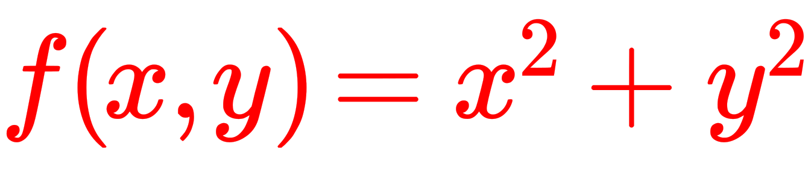

<!--
This README describes the package. If you publish this package to pub.dev,
this README's contents appear on the landing page for your package.

For information about how to write a good package README, see the guide for
[writing package pages](https://dart.dev/guides/libraries/writing-package-pages).

For general information about developing packages, see the Dart guide for
[creating packages](https://dart.dev/guides/libraries/create-library-packages)
and the Flutter guide for
[developing packages and plugins](https://flutter.dev/developing-packages).
-->

`tex` is a tiny TeX engine that creates SVG images from TeX strings.
Currently, only the math environment (e.g. `$ f(x) = x^2 $`) is supported.
Compared to other TeX renderers, this package does NOT rely on JavaScript or any other dependencies.

You will find a playground at [https://andreas-schwenk.github.io/tex](https://andreas-schwenk.github.io/tex). Alternatively, open file `/docs/index.html` in your browser. A local web server is not required.

**Warning: this package is under development. Many TeX macros, e.g. `\frac{1}{2}`, will be supported soon**

## Features

- Rendering of SVG images from TeX sources
- All data is packed into code. There is no need to load any data at runtime.

## Getting started

Add the package into your package's `pubspec.yaml` file:

```yaml
dependencies:
  tex: ^0.0.1
```

Make sure to use the latest version!

## Usage

<!-- TODO: Include short and useful examples for package users. Add longer examples
to `/example` folder. -->

```dart
import 'package:tex';

void main() {
  var tex = TeX();
  var svgImageData = tex.tex2svg("f(x,y) = x^2 + y^2");
  if (svgImageData.isEmpty) {
    print('Errors occurred: ${tex.error}');
  } else {
    print(svgImageData);
  }
}
```

Output SVG:



## Additional information

For building the fonts, `Python` and `node` must be installed. This is only required for developers of this package.

```bash
./build.sh
```

File `meta/glyphs.csv` specifies the glyphs.

## License of MathJax

This package extracts SVG image data of glyphs from [MathJax](https://www.mathjax.org). All rights remain to the authors. MathJax is licensed under the Apache2 license. You will find a copy of Apache2 license in folder `ext-licenses/` of this repository.

All extracted data from MathJax can be found in variable `svgData` of file `/lib/src/svg.dart`.

<!--TODO: Tell users more about the package: where to find more information, how to
contribute to the package, how to file issues, what response they can expect
from the package authors, and more.
-->
